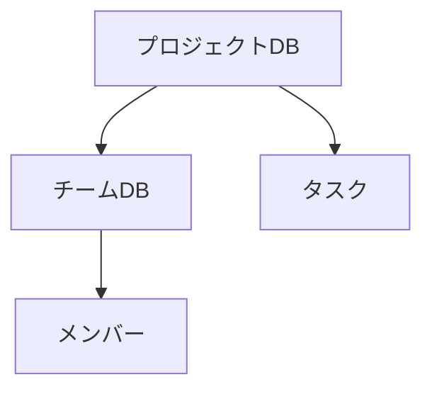

# 演習2の解答例と解説

## リレーションデータベースの実装

### 1. データベース間の関係設計


### 詳細な実装手順

1. チームデータベースの作成
```typescript
<use_mcp_tool>
<server_name>notionApi</server_name>
<tool_name>API-create-database</tool_name>
<arguments>
{
  "parent": {
    "type": "page_id",
    "page_id": "親ページのID"
  },
  "title": [
    {
      "type": "text",
      "text": {
        "content": "チーム管理"
      }
    }
  ],
  "properties": {
    "チーム名": {
      "title": {}
    },
    "リーダー": {
      "people": {}
    },
    "メンバー": {
      "people": {}
    },
    "担当プロジェクト": {
      "relation": {
        "database_id": "プロジェクトデータベースID",
        "single_property": false
      }
    },
    "ステータス": {
      "select": {
        "options": [
          {
            "name": "稼働中",
            "color": "green"
          },
          {
            "name": "準備中",
            "color": "yellow"
          }
        ]
      }
    },
    "稼働率": {
      "number": {
        "format": "percent"
      }
    }
  }
}
</arguments>
</use_mcp_tool>
```

2. プロジェクトデータベースの更新
```typescript
<use_mcp_tool>
<server_name>notionApi</server_name>
<tool_name>API-update-database</tool_name>
<arguments>
{
  "database_id": "プロジェクトデータベースID",
  "properties": {
    "担当チーム": {
      "relation": {
        "database_id": "チームデータベースID",
        "single_property": false
      }
    }
  }
}
</arguments>
</use_mcp_tool>
```

## リレーションの活用

### 1. チーム情報の登録と関連付け
```typescript
// チームの作成
<use_mcp_tool>
<server_name>notionApi</server_name>
<tool_name>API-create-page</tool_name>
<arguments>
{
  "parent": {
    "database_id": "チームデータベースID"
  },
  "properties": {
    "チーム名": {
      "title": [
        {
          "text": {
            "content": "開発チームA"
          }
        }
      ]
    },
    "ステータス": {
      "select": {
        "name": "稼働中"
      }
    },
    "稼働率": {
      "number": 80
    }
  }
}
</arguments>
</use_mcp_tool>

// プロジェクトとの関連付け
<use_mcp_tool>
<server_name>notionApi</server_name>
<tool_name>API-update-page</tool_name>
<arguments>
{
  "page_id": "プロジェクトのページID",
  "properties": {
    "担当チーム": {
      "relation": [
        {
          "id": "チームのページID"
        }
      ]
    }
  }
}
</arguments>
</use_mcp_tool>
```

### 2. 関連データの取得
```typescript
// チームが担当するプロジェクトの取得
<use_mcp_tool>
<server_name>notionApi</server_name>
<tool_name>API-query-database</tool_name>
<arguments>
{
  "database_id": "プロジェクトデータベースID",
  "filter": {
    "property": "担当チーム",
    "relation": {
      "contains": "チームのページID"
    }
  }
}
</arguments>
</use_mcp_tool>
```

## ワークフロー自動化の実装

### 1. 進捗状況の自動更新システム
```typescript
// プロジェクトの進捗確認と更新
async function updateProjectProgress() {
  // 進行中のプロジェクトを取得
  <use_mcp_tool>
  <server_name>notionApi</server_name>
  <tool_name>API-query-database</tool_name>
  <arguments>
  {
    "database_id": "プロジェクトデータベースID",
    "filter": {
      "property": "状態",
      "select": {
        "equals": "進行中"
      }
    }
  }
  </arguments>
  </use_mcp_tool>

  // 各プロジェクトのタスク完了率を計算
  for (const project of projects) {
    const progress = calculateProgress(project);
    if (progress === 100) {
      // プロジェクトを完了状態に更新
      <use_mcp_tool>
      <server_name>notionApi</server_name>
      <tool_name>API-update-page</tool_name>
      <arguments>
      {
        "page_id": project.id,
        "properties": {
          "状態": {
            "select": {
              "name": "完了"
            }
          }
        }
      }
      </arguments>
      </use_mcp_tool>
    }
  }
}
```

### 2. 期限管理の自動化
```typescript
// 期限が近いプロジェクトの確認
async function checkDeadlines() {
  const today = new Date();
  const warningDays = 7; // 1週間前に警告

  <use_mcp_tool>
  <server_name>notionApi</server_name>
  <tool_name>API-query-database</tool_name>
  <arguments>
  {
    "database_id": "プロジェクトデータベースID",
    "filter": {
      "and": [
        {
          "property": "状態",
          "select": {
            "does_not_equal": "完了"
          }
        },
        {
          "property": "期限",
          "date": {
            "next_week": {}
          }
        }
      ]
    }
  }
  </arguments>
  </use_mcp_tool>
}
```

## 高度な使用例

### 1. チーム稼働状況の自動計算
```typescript
async function updateTeamUtilization() {
  // チームごとのプロジェクト数と状況を集計
  <use_mcp_tool>
  <server_name>notionApi</server_name>
  <tool_name>API-query-database</tool_name>
  <arguments>
  {
    "database_id": "チームデータベースID",
    "filter": {
      "property": "ステータス",
      "select": {
        "equals": "稼働中"
      }
    }
  }
  </arguments>
  </use_mcp_tool>
}
```

### 2. プロジェクトダッシュボードの更新
```typescript
// プロジェクト状況のサマリー作成
async function updateDashboard() {
  <use_mcp_tool>
  <server_name>notionApi</server_name>
  <tool_name>API-update-page</tool_name>
  <arguments>
  {
    "page_id": "ダッシュボードページID",
    "children": [
      {
        "object": "block",
        "type": "heading_1",
        "heading_1": {
          "rich_text": [
            {
              "text": {
                "content": "プロジェクト状況サマリー"
              }
            }
          ]
        }
      },
      {
        "object": "block",
        "type": "paragraph",
        "paragraph": {
          "rich_text": [
            {
              "text": {
                "content": "最終更新: " + new Date().toLocaleString()
              }
            }
          ]
        }
      }
    ]
  }
  </arguments>
  </use_mcp_tool>
}
```

## ベストプラクティス

1. リレーション管理
   - 循環参照を避ける
   - 適切な関係性の設定
   - データの整合性維持

2. 自動化設計
   - エラー処理の実装
   - パフォーマンスの考慮
   - ログ記録の実装

3. スケーラビリティ
   - モジュール化された設計
   - 再利用可能なコンポーネント
   - 拡張性の確保

## 次のステップ
これらの基本実装を理解したら、以下の発展的な機能の実装に挑戦してください：

1. 複雑なワークフローの自動化
2. カスタムビューの作成
3. 外部システムとの連携
