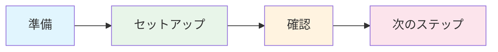
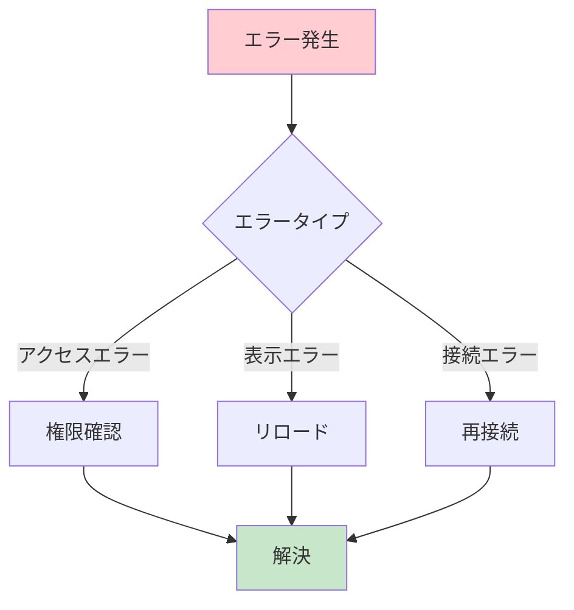
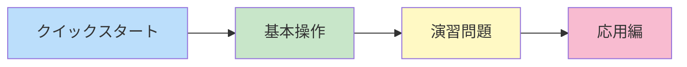

# クイックスタートガイド

## 概要
- 所要時間：約15分
- 難易度：初級
- 前提知識：なし



## 前提条件
- Notionアカウント
- VSCode環境
- Node.js（バージョン14以上）

## 1. 準備とセットアップ

### 新しいページの作成
1. ✨ Notionを開く
2. 📝 左側のサイドバーで「+」ボタンをクリック
3. 📄 「空白のページ」を選択
4. 🏷️ ページタイトルを「MCP Test Project」に設定

✅ **確認ポイント**
- [ ] 新しいページが作成されている
- [ ] タイトルが正しく設定されている

### インテグレーションの接続
1. 🔗 作成したページの右上にある「・・・」（共有メニュー）をクリック
2. ➕ 「接続を追加」（Add connections）を選択
3. 🔍 一覧から「MCP Integration」を選択
4. ✔️ 確認ダイアログで「確認」をクリック

✅ **確認ポイント**
- [ ] インテグレーションが正常に追加されている
- [ ] エラーメッセージが表示されていない

### 接続の確認
1. ⚙️ ページの右上メニューで「・・・」をクリック
2. 📋 「接続を管理」を選択
3. ✅ 「MCP Integration」が表示されていることを確認

⚠️ **トラブルシューティング**
- インテグレーションが表示されない場合：
  - ブラウザをリフレッシュ
  - インテグレーションの再追加を試行
  - 権限設定の確認

## 2. テストページの作成（デモ用）

### メインページの内容
```markdown
プロジェクト管理

このページはNotion MCPの動作確認用のテストページです。

## 目的
- APIの動作確認
- インテグレーションのテスト
- 基本機能の検証

## タスク
1. ページ作成のテスト
2. コメント機能の確認
3. 検索機能の動作確認

## 備考
このページはチュートリアルの演習で使用します。
```

✅ **確認ポイント**
- [ ] すべての見出しが正しく表示されている
- [ ] リストが適切にフォーマットされている
- [ ] テキストが読みやすく整形されている

## 3. 最終確認

### 動作確認チェックリスト
1. ページアクセス
   - [ ] 作成したページにアクセスできる
   - [ ] ページ内容が正しく表示される
   - [ ] 編集権限がある

2. インテグレーション
   - [ ] インテグレーションが接続されている
   - [ ] 権限が適切に設定されている

3. コンテンツ
   - [ ] すべてのセクションが表示される
   - [ ] フォーマットが崩れていない

### エラー対応ガイド



## 次のステップ
✅ このガイドを完了したら：
1. [基本操作チュートリアル](../02_basic_operations/search_pages.md)に進む
2. APIの基本機能を学ぶ
3. 実践的な演習に取り組む

### 学習パス


---
🎉 おめでとうございます！セットアップが完了しました。
エラーや質問がある場合は、各セクションのトラブルシューティングを参照してください。
